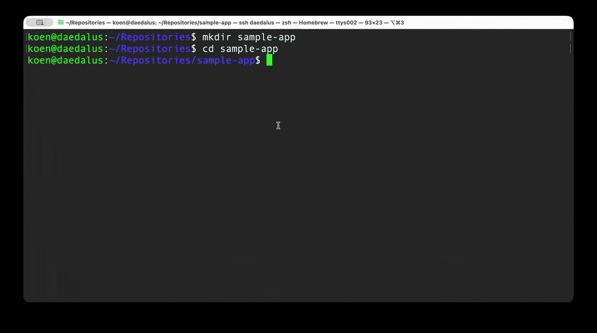

# localcode

Your AI pair programmer that never leaves your machine.



## What Is It?

localcode is a local-first AI coding assistant that runs entirely on your machine. It's a single Python file that gives you an AI pair programmer with full file system access, shell command execution, and browser automation capabilities.

**Key characteristics:**

- **100% local** - No cloud APIs, no data leaves your machine
- **Single file** - Just `localcode.py`, no complex dependencies
- **Built-in tools** - Repo mapping, file editing, shell commands, git commits, browser automation
- **Works with any llama.cpp server** - Bring your own model

## Why We Built This

We used tools like Claude Code, Codex, Cursor, and Aider. None of them fit the bill. We were tired of:

- Proprietary code and data being sent to cloud APIs
- Paying monthly subscriptions for features we didn't need
- Limited control over our development environment

Then local models like Qwen 3.5 arrived - an absolute step increase that's probably the first truly viable model for local coding. So we built localcode: a simple, local-first alternative that respects your privacy and your wallet.

## Installation

### Quick Start

```bash
# Download the single file
curl -LO https://raw.githubusercontent.com/screamingsilicon/localcode/main/localcode.py

# Make it executable
chmod +x localcode.py

# Run it (requires llama.cpp server running on http://localhost:8080)
python3 localcode.py
```

### With Docker (GPU Required)

localcode requires a GPU to run capable models for coding. We provide a docker-compose setup optimized for NVIDIA GPUs.

**Tested on RTX 5090:** ~60 tokens/second with Qwen3.5-27B

```bash
docker compose up -d
```

See [Docker Setup](#docker-setup) for details and environment configuration.

### Firefox Browser Extension

For browser automation features, install the Firefox extension:

1. Copy the `firefox_extension` folder
2. Open Firefox and navigate to `about:debugging#/runtime/this-firefox`
3. Click "Load Temporary Add-on" and select the manifest.json from the folder

## Configuration

Set environment variables before running:

```bash
export LLAMA_HOST="http://localhost:8080"    # Your llama.cpp server URL
export LLAMA_MODEL="Qwen3.5-27B"             # Model name (for display)
export LLAMA_TEMPERATURE="0.7"               # Generation temperature
export LLAMA_MAX_TOKENS="4096"               # Max tokens per response
```

Or create a `.env` file in your project directory.

## Usage

Once running, localcode enters an interactive REPL where you can:

```
> Add error handling to the edit_file function
```

The assistant will:
1. Analyze your request
2. Call tools as needed (get_repo_map, edit_file, etc.)
3. Show reasoning and results
4. Execute changes with your confirmation

### Available Tools

| Tool | Description |
|------|-------------|
| `get_repo_map` | Show repository structure with Python function/class line numbers |
| `write_file` | Create new files or overwrite existing ones |
| `edit_file` | Precise find/replace edits on existing files |
| `run_shell_command` | Execute shell commands (cat, grep, sed, etc.) |
| `commit_changes` | Stage and commit changes with git |
| `browser_execute` | Run JavaScript in the active browser tab |
| `create_eval` | Create an evaluation function for autoresearch optimization |
| `start_autoresearch` | Begin an automated optimization loop |

### Commands

- `/add <pattern>` - List files matching glob pattern
- `/ctx` - Show context status
- `/status` - Show repository info
- `/compress` - Compress large tool outputs
- `/clear` - Clear conversation history
- `/undo` - Undo last commit
- `/help` - Show all commands
- `!<command>` - Run shell command directly
- `/exit` - Exit

## AutoResearch Mode

localcode can run automated optimization loops to improve your code iteratively. This is useful for performance tuning, code quality improvements, or any task that can be measured.

### How It Works

1. **Define an evaluation function** - Create `eval.py` in your repository root with a function that returns a numeric score
2. **Request optimization** - Ask localcode to optimize your code for a specific goal
3. **Agent runs optimization loop** - localcode iteratively makes changes, evaluates them, and keeps improvements
4. **Best version is tracked** - The best-performing code is tagged with `autoresearch-best`

### Example: Optimizing Performance

**Step 1: Create an eval function**

```python
# eval.py
def evaluate() -> float:
    """Measure execution time. Return negative time (higher is better)."""
    import time
    from src.solver import solve
    
    start = time.time()
    solve()
    elapsed = time.time() - start
    
    return -elapsed  # Negative because lower time = better
```

**Step 2: Request optimization**

```
> Make the solver in src/solver.py faster
```

localcode will:
- Create or use your `eval.py`
- Run an optimization loop (default 20 iterations)
- Make changes, test, and keep improvements
- Stop early if no improvement for 5 iterations

**Step 3: Review results**

```
[AutoResearch] ✓ Optimization complete
  Best score: -0.042s (from -0.156s baseline)
  Total iterations: 8
```

The best version is tagged as `autoresearch-best` in git.

### Eval Function Guidelines

Your `eval.py` should:

- **Be deterministic** - Same code produces same score
- **Run quickly** - Under 30 seconds per evaluation
- **Have no side effects** - Don't modify files or state
- **Return a float** - Higher is better (use negative for time/memory)
- **Be importable** - No arguments needed

### Common Eval Patterns

**Performance (execution time):**
```python
def evaluate() -> float:
    import time
    from src.app import main
    start = time.time()
    main()
    return -(time.time() - start)  # Negative time
```

**Memory usage:**
```python
def evaluate() -> float:
    import tracemalloc
    from src.app import main
    tracemalloc.start()
    main()
    _, peak = tracemalloc.get_traced_memory()
    tracemalloc.stop()
    return -peak / 1_000_000  # Negative MB
```

**Test pass rate:**
```python
def evaluate() -> float:
    import subprocess
    result = subprocess.run(["python", "-m", "pytest", "-q"], 
                           capture_output=True, text=True)
    return 1.0 if result.returncode == 0 else 0.0
```

**Code quality (complexity):**
```python
def evaluate() -> float:
    from radon.complexity import cc_analysis
    result = cc_analysis("src/solver.py")
    avg_complexity = result.average()
    return 10 - min(avg_complexity, 10)  # Lower complexity = higher score
```

### State Persistence

AutoResearch saves progress to `.autoresearch/log.json`:
- Current iteration count
- Best score and commit hash
- Full history of all iterations
- Optimization status

You can interrupt and resume optimization at any time.

### Best Practices

1. **Start simple** - Begin with a basic eval, refine as needed
2. **Test your eval** - Ensure it works before starting optimization
3. **Watch the iterations** - Agent shows progress and can be interrupted
4. **Review changes** - Check git diff before accepting improvements
5. **Use for clear goals** - Works best when success is measurable

## Docker Setup

The `docker-compose.yml` file provides a GPU-optimized setup for NVIDIA GPUs:

```yaml
services:
  qwen3-llm:
    image: ghcr.io/ggml-org/llama.cpp:server-cuda
    container_name: qwen3-llm
    restart: unless-stopped
    ports:
      - "8123:8123"
    volumes:
      - ./unsloth:/root/.cache/llama.cpp:rw
    environment:
      - LLAMA_CACHE=/root/.cache/llama.cpp
    deploy:
      resources:
        reservations:
          devices:
            - driver: nvidia
              count: all
              capabilities: [gpu]
    command:
      - "-hf"
      - "unsloth/Qwen3.5-27B-GGUF:UD-Q6_K_XL"
      - "-ngl"
      - "99"
      - "--ctx-size"
      - "90000"
      - "--temp"
      - "0.7"
      - "--top-p"
      - "0.9"
      - "--top-k"
      - "20"
      - "--min-p"
      - "0.0"
      - "--host"
      - "0.0.0.0"
      - "--port"
      - "8123"
```

**Performance notes:**
- Tested on RTX 5090 achieving ~60 tokens/second
- Uses Qwen3.5-27B quantized with UD-Q6_K_XL
- Full GPU offloading (`-ngl 99`)
- Large context window (90K tokens)

### Point localcode to the Container

After starting the Docker container:

```bash
export LLAMA_HOST="http://localhost:8123"
export LLAMA_MODEL="Qwen3.5-27B"
python3 localcode.py
```

### Customization

To use a different model or adjust settings, modify the `command` section in `docker-compose.yml`:

- Change the model: `-hf "unsloth/Qwen3.5-14B-GGUF:Q6_K"`
- Adjust context size: `--ctx-size 32768`
- Modify temperature: `--temp 0.5`

## Architecture

```
┌─────────────┐    ┌──────────────┐    ┌─────────────┐
│   You (CLI) │◄──►│  localcode   │◄──►│ llama.cpp   │
└─────────────┘    └──────────────┘    └─────────────┘
                          │
          ┌───────────────┼───────────────┐
          ▼               ▼               ▼
    ┌──────────┐   ┌──────────┐   ┌──────────────┐
    │  Files   │   │  Shell   │   │  Browser     │
    │  System  │   │  Commands│   │  Bridge      │
    └──────────┘   └──────────┘   └──────────────┘
```

localcode acts as a bridge between you and your local LLM, translating natural language requests into tool calls and executing them safely within your repository.

## License

This project is licensed under the [GNU Affero General Public License v3.0](LICENSE).

**What this means:**

- ✅ You can use it freely for personal and internal projects
- ✅ You can fork and modify it
- ✅ If you distribute modified versions, you must open-source them
- 📧 For commercial integration or separate licensing, contact the authors

We believe in keeping localcode open and accessible. If you're building something commercial that depends on localcode, we'd love to hear from you and discuss options.

## Contributors

- **Koen van Eijk** - [vaneijk.koen@gmail.com](mailto:vaneijk.koen@gmail.com)
- **Thomas van Turnhout** - [tvturnhout@gmail.com](mailto:tvturnhout@gmail.com)

## Questions or Issues?

Found a bug? Have a feature request? Open an issue on GitHub or reach out directly to the contributors.

---

Built with ❤️ by Koen & Thomas
